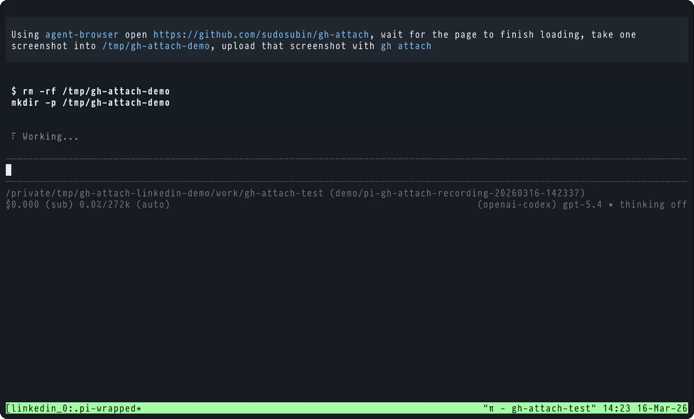

<div align="center">

# gh-attach

[](https://github.com/sudosubin/gh-attach/releases/latest)
[](https://go.dev/)
[](./LICENSE)
[](https://github.com/sudosubin/gh-attach/releases)

GitHub user attachment upload CLI for `gh` (GitHub CLI).

<a href="docs/gh-attach.mp4">
  
</a>

</div>

## Quick Start

```sh
gh extension install sudosubin/gh-attach
gh attach ./image.png -R owner/repo
```

## Installation

Requires [GitHub CLI](https://github.com/cli/cli#installation). If you haven't authenticated yet, run `gh auth login`.

```sh
gh extension install sudosubin/gh-attach
gh attach ./image.png -R owner/repo
```

<details>
<summary>Standalone binary via Homebrew</summary>

This installs the standalone `gh-attach` binary, not the `gh` extension wrapper.
If you want to run `gh attach`, use the GitHub CLI extension above.

```sh
brew install --cask sudosubin/gh-attach/gh-attach
gh-attach ./image.png -R owner/repo
```

</details>

<details>
<summary>Standalone binary via GitHub Release</summary>

Open the [latest release](https://github.com/sudosubin/gh-attach/releases/latest) page and download the artifact matching your OS/CPU.

</details>

## Usage

```sh
$ gh attach ./image.png -R owner/repo
https://github.com/user-attachments/assets/550e8400-e29b-41d4-a716-446655440000

$ gh attach ./image.png -R owner/repo --browser chrome --profile Default
https://github.com/user-attachments/assets/550e8400-e29b-41d4-a716-446655440000

$ gh attach ./image.png --json id,href,name
{
  "href": "https://github.com/user-attachments/assets/550e8400-e29b-41d4-a716-446655440000",
  "id": 123,
  "name": "image.png"
}

$ gh attach ./image.png --json href,name --template '{{.name}} -> {{.href}}'
image.png -> https://github.com/user-attachments/assets/550e8400-e29b-41d4-a716-446655440000
```

### Options

- `-R, --repo <[HOST/]OWNER/REPO>`: Target repository. Auto detection is available from current repository.
- `--browser <name>`: Browser to read cookies from (`auto|chrome|chromium|edge|firefox|safari|brave|vivaldi|opera`).
- `--profile <name-or-path>`: Browser profile name/path. For Firefox multi-account containers, append `:<container-name>` or `:id=<container-id>` to pin a specific container (e.g. `default:Work`, `default:id=2`).
- `--cookie-store-path <path>`: Explicit cookie DB file path.
- `--json <fields>`: Output JSON with selected fields.
- `-q, --jq <expression>`: Apply jq filter to JSON output (requires `--json`).
- `-t, --template <go-template>`: Format JSON output using Go template (requires `--json`).
- `-v, --verbose`: Print cookie source resolution logs to stderr.
- `-h, --help`: Show help.

## Config File

You can use a config file to register frequently used browser settings without having to pass them as command line arguments each time.

The config file is loaded from `${XDG_CONFIG_HOME:-~/.config}/gh/attach.yml`.

**Example**

```yaml
browsers:
  - browser: chrome
    profile: Default
  - browser: firefox
    profile: default-release
  - browser: safari
```

**Schema**

- `browser`: Browser to read cookies from (Required, one of `auto|chrome|chromium|edge|firefox|safari|brave|vivaldi|opera`)
- `profile`: Browser profile name/path (Optional, name or path)
- `cookie_store_path`: Explicit cookie DB file path (Optional)

## Supported Browsers

- Chromium family (Chrome, Chromium, Edge, Brave, Vivaldi, Opera)
- Firefox
- Safari

## How it works

- It first resolves the target repository (`owner/repo`) and the current GitHub login via the `gh` API.
- Based on CLI flags or config file, it looks up browser cookie sources and selects a session whose [`dotcom_user`](https://docs.github.com/en/site-policy/privacy-policies/github-cookies#cookies) matches the current login.
- Using that session cookie, it requests GitHub upload policies (`/upload/policies/assets`) and uploads the file binary.
- It finalizes the user-attachments asset and prints the result as a URL or formatted output via `--json`.
